## PRAKTIKUM 7

## Latihan 1

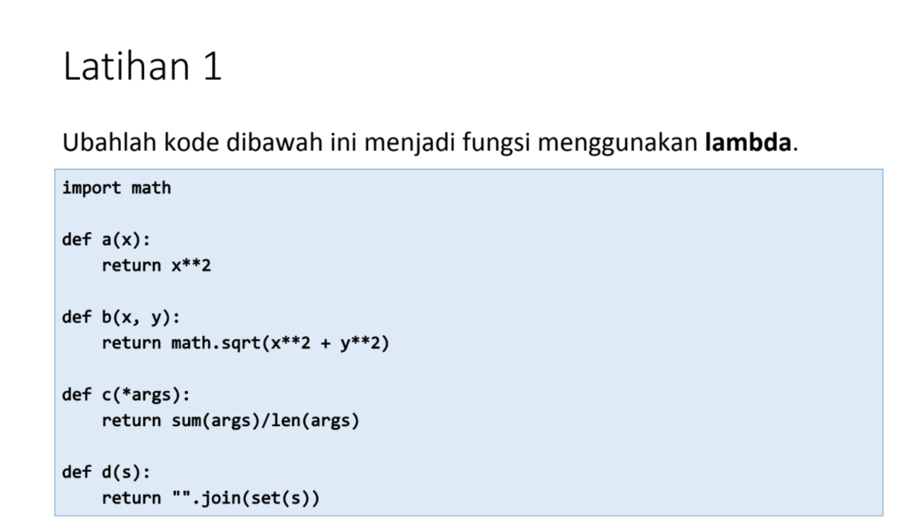

Masukan codingan seperti dibawah ini:

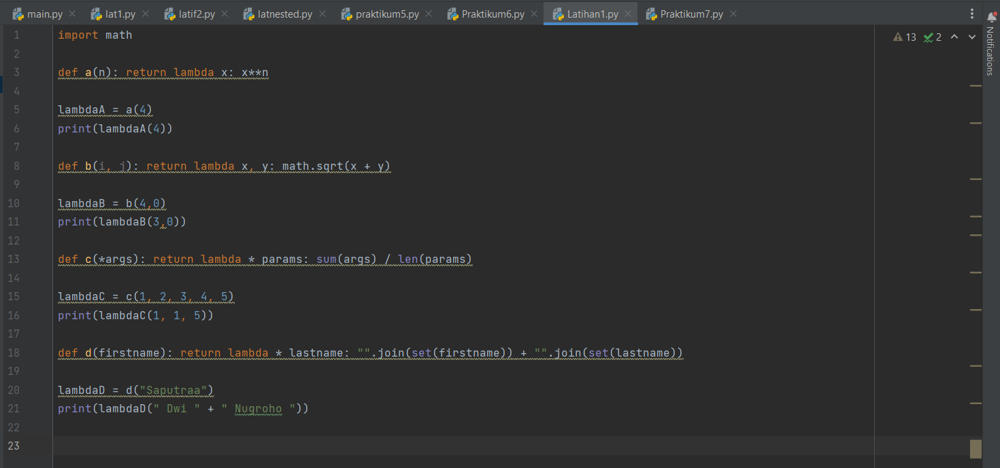

Hasil Outputnya :

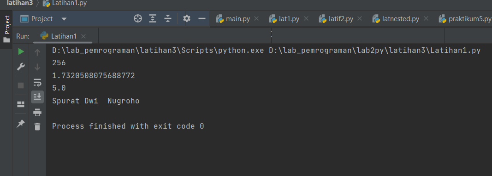

## TUGAS PRAKTIKUM 

Buat program sederhana dengan mengaplikasikan penggunaan fungsi yang akan menampilkan daftar nilai mahasiswa, dengan ketentuan: • Fungsi tambah() untuk menambah data • Fungsi tapilkan() untuk menampilkan data • Fungsi hapus(nama) untuk menghapus data berdasarkan nama • Fungsi ubah(nama) untuk mengubah data berdasarkan nama • Buat flowchart dan penjelasan programnya pada README.md.

Masukan Codingan sebagai berikut:

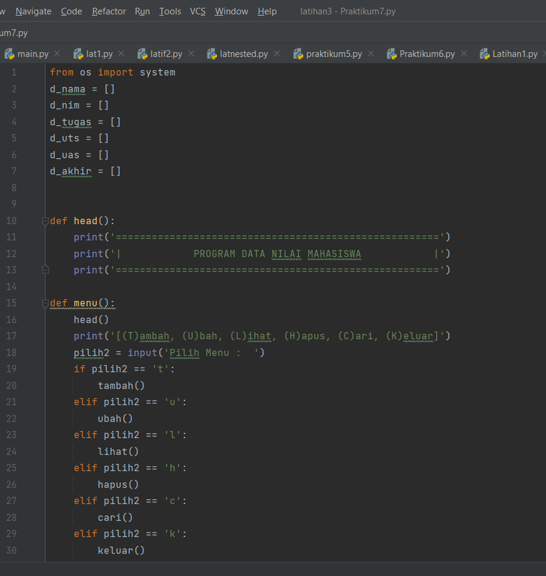
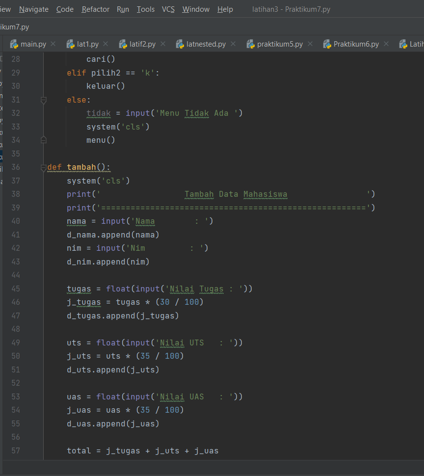
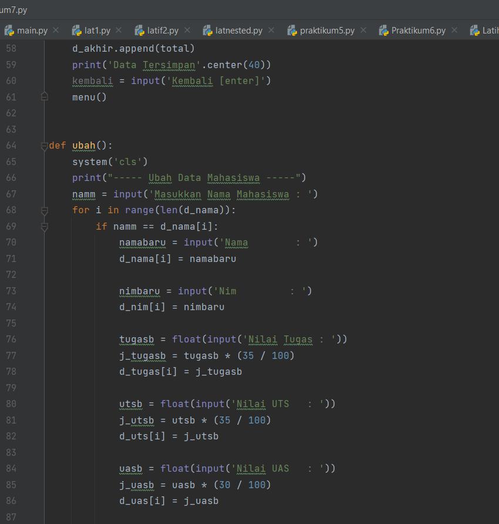
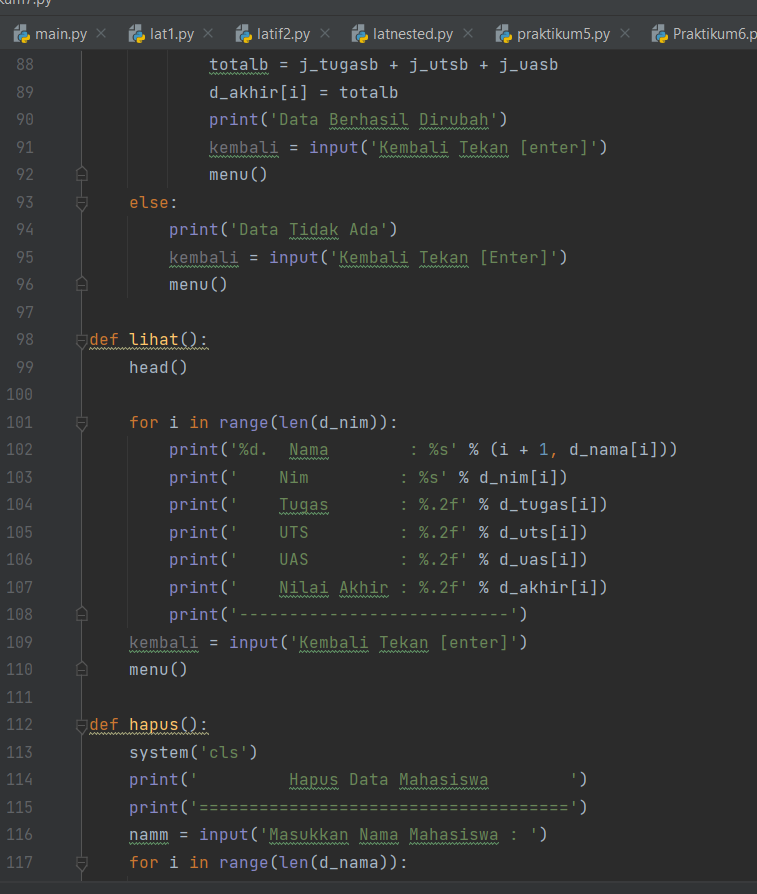
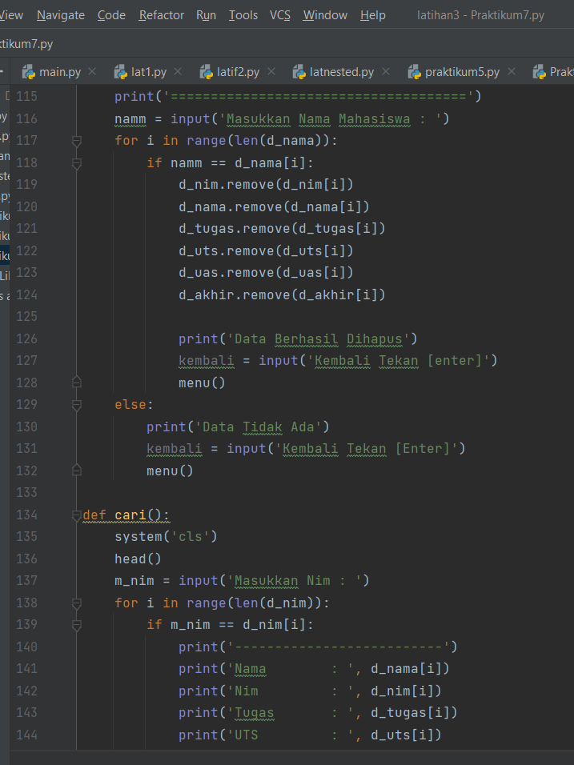
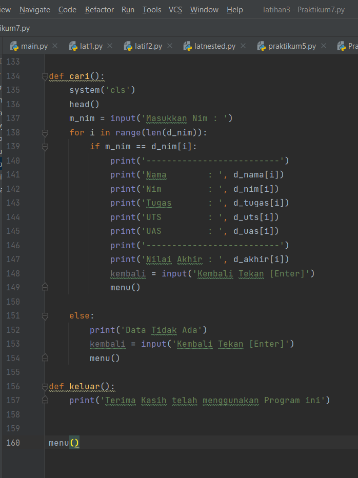

Hasil Outputnya sebagai berikut :

## tampilan awal

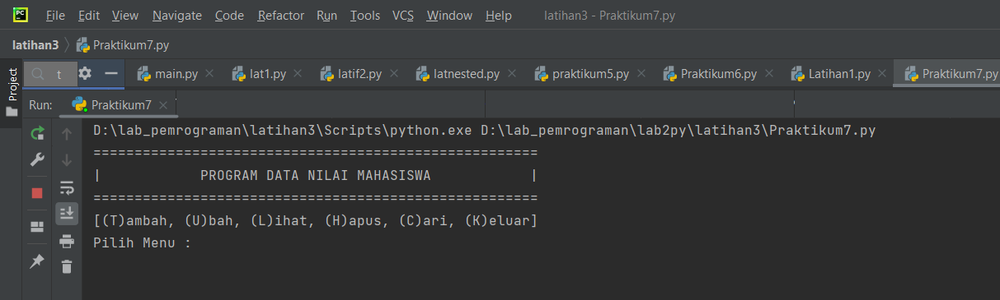

## tampilan untuk menambah data

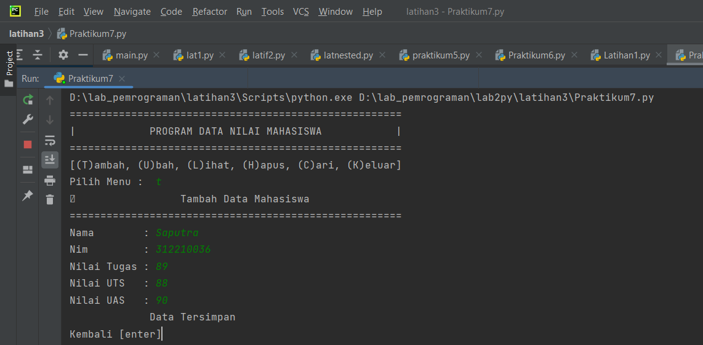

## tampilan ubah data

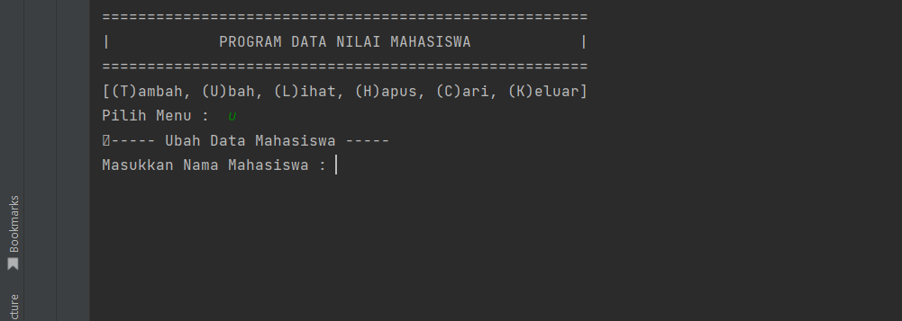
 
 ## tampilan lihat data

 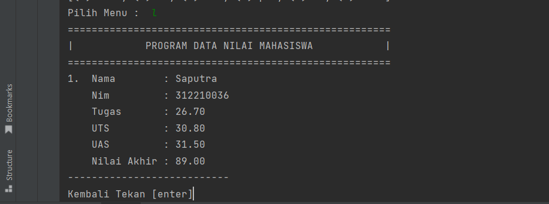

 ## tampilan hapus data

 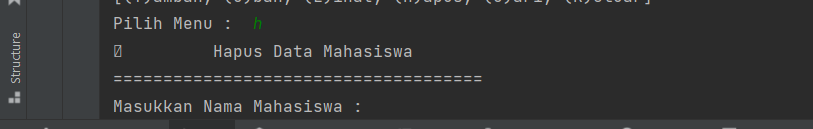

 ## tampilan keluar 

 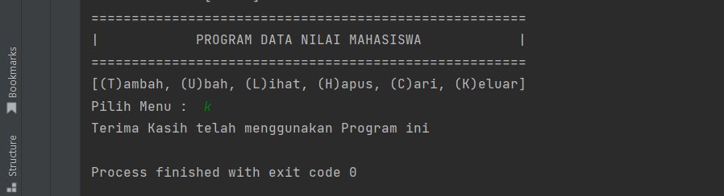

## FLOWCHART

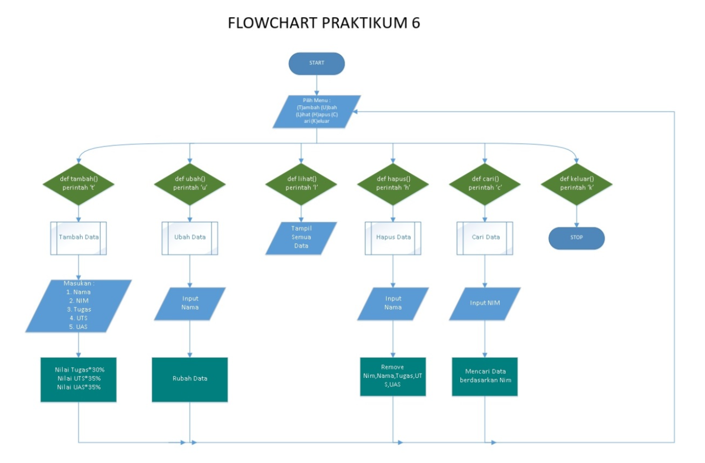

